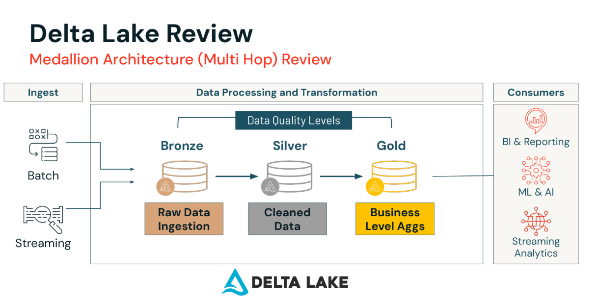
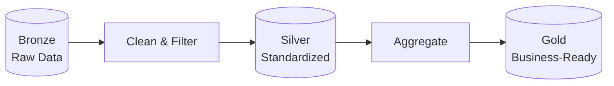
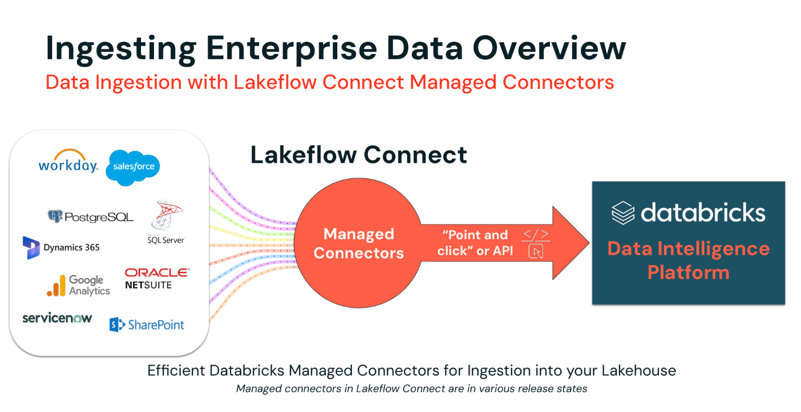
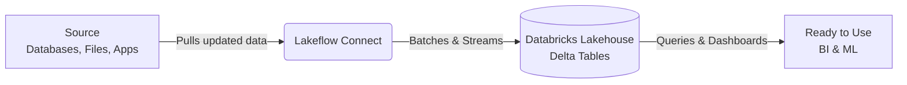
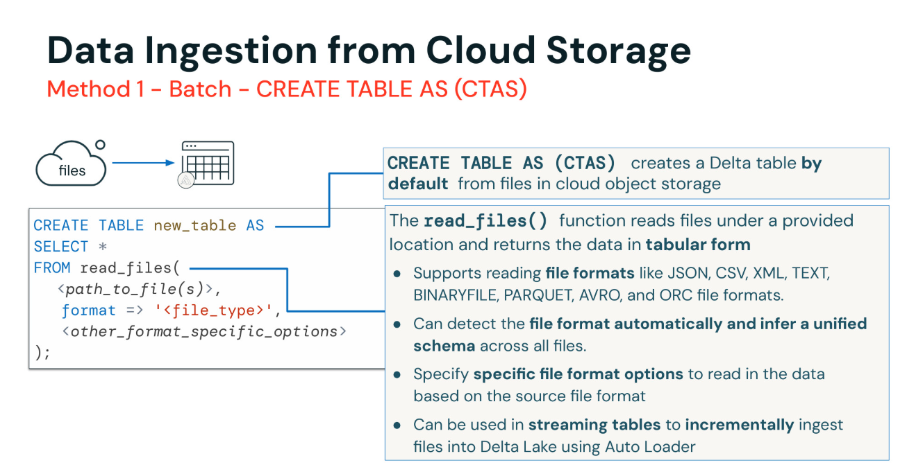
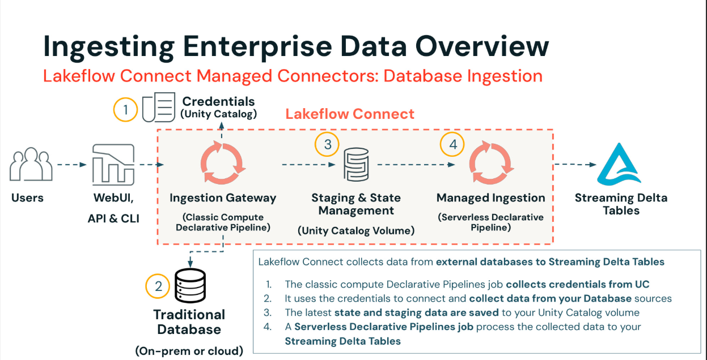

# The Databricks Associate Course KT Doc by Avi

## Introduction: The Data Factory
Welcome to the modern era of data engineering. Before we dive into the moving parts of building data pipelines, we need to understand the engines and factories that make it all possible.

### Why Apache Spark?
Imagine you have to read a massive encyclopedia and find every mention of the word "data." If you do it alone, it might take a year. If you give one page to 10,000 friends, it takes a few seconds. 

That is **Apache Spark**. It is a blazingly fast, distributed data processing engine. It was created because traditional databases and single-server systems couldn't handle the massive scale of big data. Spark breaks down massive tasks and distributes them across clusters of computers, computing them in parallel.

### Enter Databricks
If Spark is the engine, **Databricks** is the entire car, complete with navigation, climate control, and a comfortable dashboard. In layman's terms: **Databricks is a platform to process, analyze, and manage big data easily using Spark in the cloud—just like a big, smart factory for your data.** It manages the complicated servers, gives your team a place to write code collaboratively, and handles data security.

### The ETL Process
At the heart of our data factory is **ETL**:
*   **Extract:** Gathering raw data from scattered sources (databases, APIs, files).
*   **Transform:** Cleaning, filtering, and organizing that raw data.
*   **Load:** Placing the polished data into a highly organized storage system for reporting.

### Delta Lake: Smarter Storage
Databricks uses a technology called **Delta Lake**. It’s a smarter way to store data in Databricks. Unlike a traditional "data lake" where files are just dumped and forgotten (a "data swamp"), Delta Lake brings order and reliability:
*   **ACID Transactions:** Ensures writes are "all-or-nothing". Partial data crashes won't corrupt your files.
*   **Version History:** Every change is tracked, allowing for "time travel" to audit or roll back mistakes.

#### The Medallion Architecture
Delta Lake organizes data using the Medallion Architecture, a sequence of refinement from raw to business-ready.




*   **Bronze:** The raw landing zone exactly as the data arrived.
*   **Silver:** Cleaned, deduplicated, and standardized.
*   **Gold:** Aggregated tables optimized for BI (Business Intelligence) and ML (Machine Learning).

---

## Module 1: Data Ingestion with Lakeflow Connect

### What is Data Ingestion?
In layman's language, data ingestion is **simply getting data into the system.** Whether it's daily spreadsheets from a vendor or live clicks from an app, to do any analytics, you first need to land the data in Databricks.

### What is Lakeflow Connect?


Imagine trying to lay plumbing to hundreds of houses manually—it's a nightmare. **Lakeflow Connect** is a ready-made pipe system built into Databricks. It automatically handles the complicated parts of bringing enterprise data into your Delta Lake, so you don't have to maintain fragile custom scripts.



### Methods of Data Ingestion
Now let's get into the technical mechanics. Depending on the speed and shape of your data, you'll use different tools.

#### 1. Data Ingestion from Cloud Storage
This is the most common starting point. Files land in cloud storage, and Databricks ingests them.



**A. CREATE TABLE AS (CTAS) - Batch Load**
Best for quick, one-time bulk loads. It creates and populates a Delta table from files in a single step.

```sql
-- Create a new table directly from a set of files
CREATE TABLE catalog.schema.new_table AS
SELECT *
FROM read_files(
  'path/to/your/files/*',
  format => 'csv',
  header => 'true',
  inferSchema => 'true'
);
```

**B. COPY INTO**
Best for incremental batch loads. It is *idempotent* (rerunning it won't create duplicates) and keeps track of which files it has already ingested, skipping them on future runs to save money and time.
```sql
-- First, create an empty table
CREATE TABLE catalog.schema.target_table (
  id INT,
  event_time TIMESTAMP,
  device_id STRING
);

-- Incrementally copy new files into the table
COPY INTO catalog.schema.target_table
FROM 'path/to/new/files/'
FILEFORMAT = 'JSON'
COPY_OPTIONS ('force' = 'false'); -- 'false' ensures we don't re-process files
```

**C. Auto Loader - Streaming / High-Volume**
The most powerful and scalable method for files. It uses cloud notification services to efficiently discover new files as they arrive and can handle schema evolution automatically.
```python
# Python example for a streaming read with Auto Loader
(spark.readStream
  .format("cloudFiles")
  .option("cloudFiles.format", "json")
  .option("cloudFiles.schemaLocation", "path/to/schema/checkpoint")
  .load("path/to/source/files")
  .writeStream
  .option("checkpointLocation", "path/to/write/checkpoint")
  .trigger(availableNow=True) # Or processingTime='1 minute'
  .toTable("catalog.schema.destination_table")
)
```

#### 2. Appending Metadata & Using the Rescued Data Column
When ingesting files, knowing *where* it came from is critical. Databricks allows us to append metadata columns like `_source_file` or `_ingest_ts`.

Furthermore, imperfect data (like unexpectedly formatted CSVs) can break pipelines. Databricks handles this with a **Rescued Data Column**. Instead of crashing the job, Spark puts the corrupted or unidentified rows into a special JSON column. The pipeline completes, and you can audit the messy records later.

#### 3. Ingesting Semi-Structured Data: JSON
When dealing with JSON files, you often have nested fields (arrays within objects). 
*   **Layman concept:** It's like finding a Russian nesting doll of data.
*   **Best Practice:** Always land the raw, unflattened JSON straight into your Bronze layer. You can unpack it (`explode()`, `from_json()`) when moving to the Silver layer.

#### 4. Ingesting Enterprise Data Overview
You don't always ingest simple files. Often you need data directly from highly managed enterprise systems (Salesforce, Workday, PostgreSQL, SQL Server).
Lakeflow Connect provides **Managed Connectors**. Rather than writing Python scripts with usernames and passwords to query Salesforce APIs, you provide the credentials securely via **Unity Catalog**, and Databricks manages an Ingestion Gateway that reliably mirrors the database directly into Streaming Delta Tables.



#### 5. Ingesting into Existing Delta Tables (Merge Into)
Once data lands, sometimes you need to apply updates to an existing master table without dropping the old one. We use `MERGE INTO`, which lets us **upsert** (Update if existing, Insert if new).

This is the backbone of Change Data Capture (CDC) patterns.


**Technical Syntax:**
```sql
MERGE INTO main_users_target AS target
USING source_updates AS source
ON target.id = source.id
WHEN MATCHED AND source.is_deleted = true THEN
  DELETE
WHEN MATCHED THEN
  UPDATE SET
    target.email = source.email,
    target.status = source.status
WHEN NOT MATCHED THEN
  INSERT (id, first_name, email, sign_up_date, status)
  VALUES (source.id, source.first_name, source.email, source.sign_up_date, source.status);
```